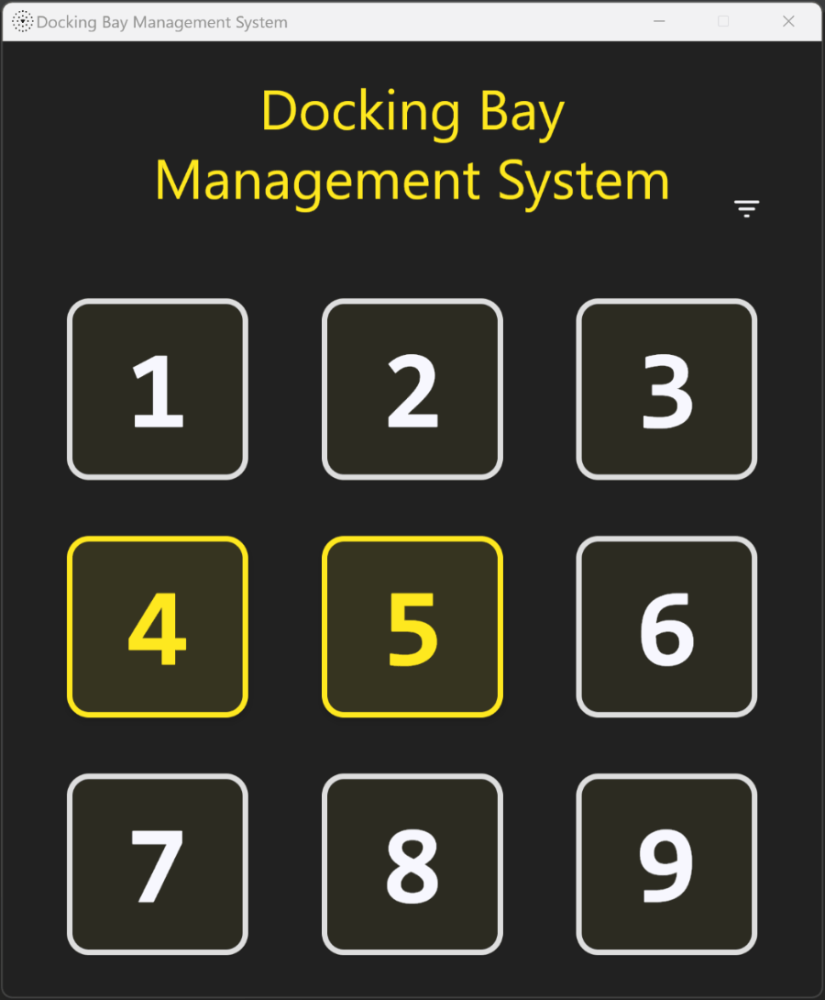

# :star::rocket: Docking Bay Management System

This is a sample Kotlin Multiplatform desktop project accompanying the [KotlinConf 2024 introductory talk](https://www.youtube.com/watch?v=YOXWnM_8vz8) for the [Exposed library](https://github.com/JetBrains/Exposed).

## Run Desktop Application

* Run Ktor Gradle task `buildFatJar`
* Run `docker compose up`
* The server responds at http://127.0.0.1:8080 to check routes, if needed.
  * See details about the Ktor server application in the `server` module
  * See details about the Ktor HttpClient in the `common/commonMain/client` package
* Once the server has started, run `Main.kt` from the `desktop` module

**Note** that the default data access approach is set to the Domain Specific Language (DSL) approach.
This can be changed to the Data Access Object (DAO) approach in `application.conf` by commenting out the desired `dataAccess` property.

**Note** that the server will automatically shut down as a part of the application exit process.